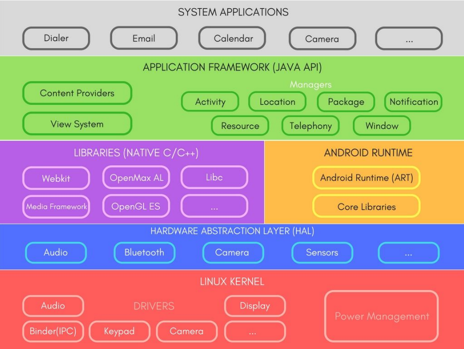

# Общая информация о системе: Полезные тулзы и команды

[Termux](https://termux.com/) - linux on Android  
Можно использовать для запуска git и прочего дерьма на андроиде  
Пример установки пакета:  
`pkg install git`  
`pkg install inotify-tools`

`pidcat` - tool для логирования по pid

Некоторые скрипты, которые облегчают действия на телефоне  
[https://github.com/zhenleiji/AndroidScripts](https://github.com/zhenleiji/AndroidScripts)

Получить PID приложения:  
`adb shell pidof -s com.app.test`

Запустить logcat для конкретного приложения:  
`adb logcat --pid 11111`

В Android приложении могут быть папки вида `%container%/app_/*`   
В приложении Android к ним доступ осуществляется через функцию `Context.getDir("")`;

Как отключить или удалить любое приложение с телефона Android:  
Отключить:   
`$ adb shell pm disable-user --user 0 <имяотключаемогопакета>`  
Включить:   
`$ adb shell pm enable <имяотключенногопакета>`  
Список отключенных приложений:   
`$ adb shell pm list packages -d`  
Полностью удалить приложение:   
`$ adb pm uninstall -k --user 0 <имя_пакета>`

Узнать информацию о процессоре `cat /proc/cpuinfo`

Получить android\_id: `adb shell settings get secure android_id`  

База accounts\[\_de\|\_ce\|\].db хранит токены гугла и другую информацию, которую пожелает приложение там хранить.   
Где находится:   
1. `/data/system/users/0/accounts.db`   
2. На новых телефонах `/data/system[_ce|_de]/users[_ce|_de]/0/accounts*`

Для новых телефонов \(с обновой от первого июля 2018\), взамен `pm` пришла команда `cmd` \(посмотреть, что может: `cmd package help`\)   
Посмотреть список установленных пакетов:   
`$ adb shell $ cmd package list packages -f`

Забрать APK с не рученного телефона:   
`$ adb shell   
$ pm list packages # Получили список пакетов   
$ pm path com.test.package # Получаем путь до пакета   
$ exit   
$ adb pull <Путь> # и никакого рута не надо :)`  

UID's приложений `/data/system/packages.list`   
в `packages.xml` еще и `Permissions`, и к каким сервисам системным для приложения необходим доступ

Все UID'ы, которые могут быть в Android \(Linux?\) системах: 



API-levels:   
Android 8.0 - Oreo - 26   
Android 7.1 - Nougat - 25   
Android 7.0 - Nougat - 24   
Android 6.0 - Marshmallow - 23   
Android 5.1 - Lollipop - 22   
Android 5.0 - Lollipop - 21   
Android 4.4-4.4.4 - KitKat - 19

У андроида есть AT-команды, которые позволяют с ним взаимодействовать даже, если он выключен

Отслеживание процессов и приложений \(варианты\)   
1 fsmon \(inotify\) - отслеживает обращение к файловой системе \(модно указать типы событий и перечислить файлы\). Есть ограничения на количество файлов для одного пользователя \(ограничение дает inotify, его можно изменить\)   
2 atrace - отслеживает кучу событий приложений. Возможно, встроена в любом андроиде   
3 systrace - часть Platform Tools. atrace - часть systrace   
4 strace - отдельная тулза для Unix систем

Про inotify:   
inotify нюансы:   
1. Информацияоб отслеживаемых дескрипторах: /proc/{PID}/fdinfo   
2. API не предоставляет никакой инфы о процессе \(или пользователе\), который запустил событие inotify   
В частности, для процесса, который отслеживает события с помощью inotify, нет простого способа отличить события, которые он запускает, от событий, которые запускаются другими процессами

cmd - команды сервисам каким-то дать типо ?  
cmd package - работа с менеджером пакетов  
cmd package list &lt;features \| packages \| libraries \| instrumentation \| permission-groups \| permissions&gt;

